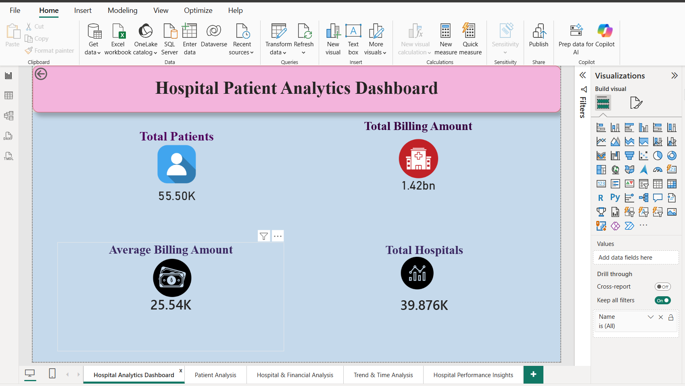
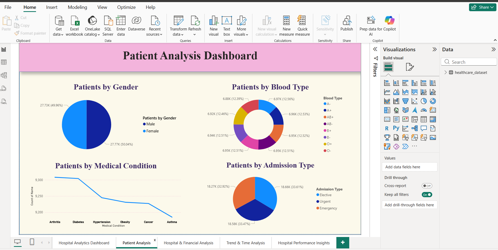
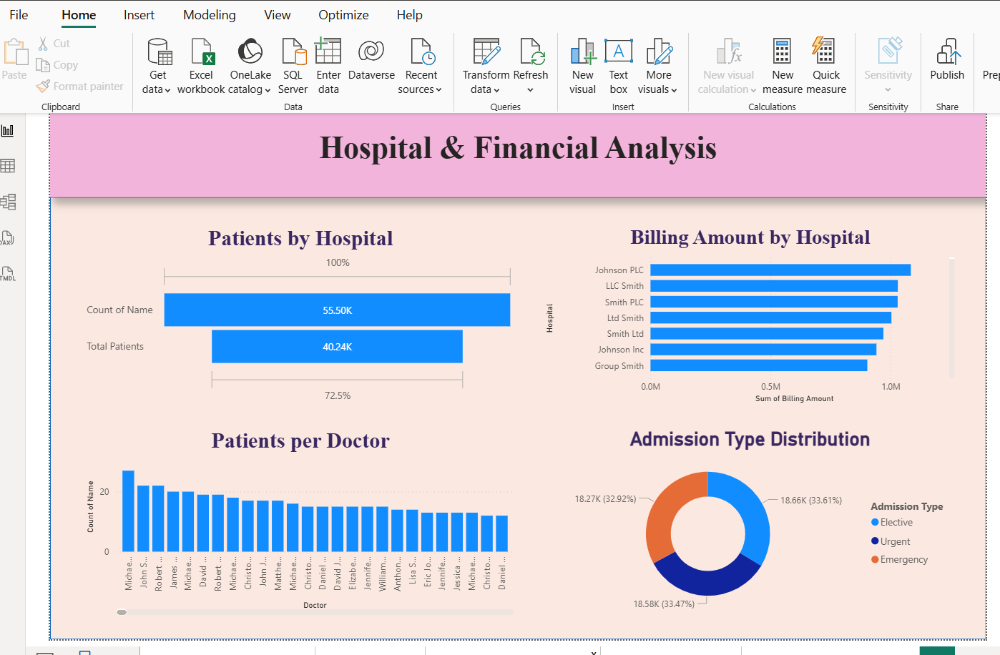
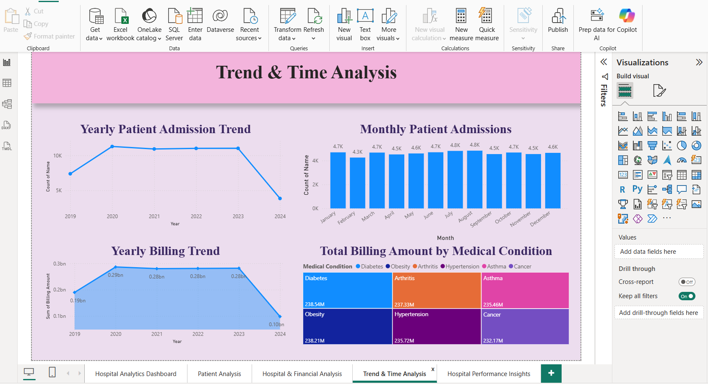
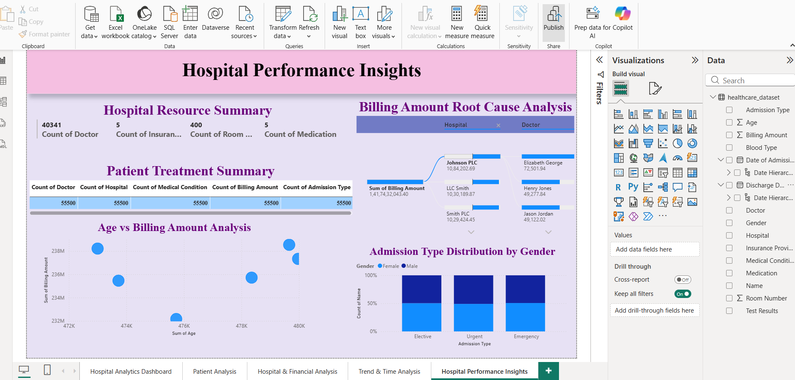

Hospital Patient Analytics Dashboard (Power BI)

Project Overview
This project analyzes hospital patient data using Microsoft Power BI.  
The dashboard provides insights into patient demographics, hospital performance, billing trends, and healthcare analytics.

Tools Used
- Microsoft Power BI
- Power Query
- DAX
- CSV Dataset

Dataset Features
The dataset includes:
- Age
- Gender
- Blood Type
- Medical Condition
- Hospital
- Doctor
- Insurance Provider
- Admission Type
- Billing Amount
- Test Results
- Medication

Dashboard Pages

1. Hospital Analytics Dashboard
Shows overall KPIs including total patients, billing amount, average billing amount, and number of hospitals.

2. Patient Analysis
Displays patient distribution by gender, blood type, admission type, and medical conditions.

3. Hospital & Financial Analysis
Provides insights into hospital performance, billing comparison, and patient distribution across doctors.

4. Trend & Time Analysis
Shows yearly and monthly patient admissions and billing trends.

5. Hospital Performance Insights
Advanced analysis including hospital resource summary, treatment summary, and root cause analysis.

Dashboard Screenshots

 Hospital Analytics Dashboard

Patient Analysis

Hospital & Financial Analysis

Trend & Time Analysis

Hospital Performance Insights

Key Insights

• Patient admissions are almost evenly distributed across Elective, Urgent, and Emergency categories.

• Medical conditions like Diabetes and Obesity contribute to higher billing amounts.

• Hospital billing performance varies between hospitals, showing differences in treatment volumes.

• Monthly patient admissions remain relatively stable throughout the year.

Author
Charan kumar anumasu
